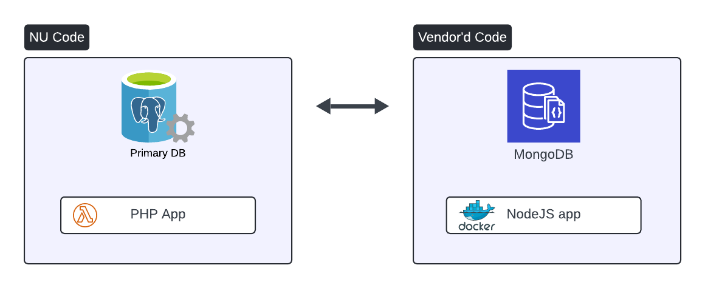
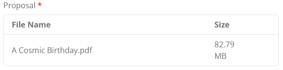
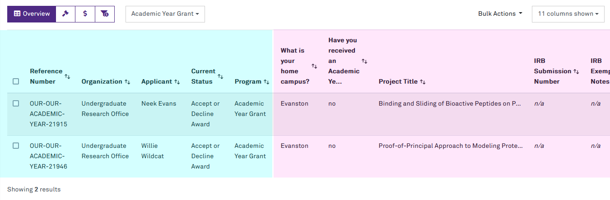
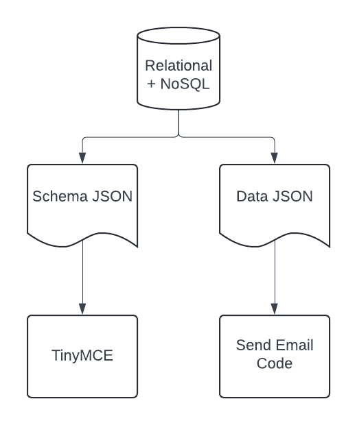

<!-- _class: lead -->
<!-- _paginate: false -->

# Solving a Perennial Problem 
#### with Dynamic Forms for Laravel

Presented by Nick Evans
<small>Lead Solution Architect @ NUIT</small>


---

<!-- Just to set things up: this is a case study. We made some cool tech as part of a larger project, and I want to talk about it.

There were some interesting challenges in using this tech. It solved some problems, but created new ones.

If you have questions as we're going through, just shout me down and ask!
-->

# Goal
- We did a cool thing
- I'm going to tell you about the cool thing
- Some of it is open source

**Feel free to ask questions as you have them!**


---

<!-- We often have a problem: we've got an app that was built to solve some specific problems and do a specific workflow. But as the years roll on, it grows and grows...it's not just a form collecting some data for one person. It's a platform with two dozen forms, all handled slightly differently.

 You've probably all been here. It becomes a drain on our time to keep it going. At any given moment, *somebody* will want to change *something* in there, right? And it's usually small things, "oh we need a new value in this dropdown".
 
 And that's important for them. I'm not saying those sorts of changes are unimportant! 
 
 What I am saying, is that it becomes a little absurd when we're paying a highly-trained, experienced senior developer to change the colours of buttons or whatever for a week out of every month.
 -->

# Problem
- We have lots of forms in our app
- Users always changes to forms
    - New instructions
    - Change the validations
    - New fields
    - Update a dropdown
    - Whole new forms!

---

<!-- I've defined a general class of problem, but that's kind of abstract. For better storytelling, let's do a case study on an actual project: SOAP. This thing exists, and we learned quite a lot about the new problems that get created when we solve the original problem. 

SOAP is a workflow system, but oriented towards grant-makers and grant-seekers. Grant opportunities come and go as the academic years roll by, right? Or the requirements change, or the funding amounts change...or the grant-makers want to collect different data.

Before SOAP, NUIT had another piece of software, and we'd basically have to implement a workflow from scratch in PHP every time somebody had a bunch of money to give away. 

That app started out as one workflow and one form. For a single form, why build anything fancy, right? Slap down some HTML, a few validations, make a DB table, show the records in a datagrid, *done*.

But nothing stays in that state. They came up with more grants ... and other departments heard about the grant workflow system and joined up. 

So, our goal with SOAP was to make everything self-service. We wanted something easy for a program assistant-type person to use. 

If, for example, HR changed some of the payroll paperwork we need to collect: it should be easy for a program assistant to go in and change what files need to be uploaded to receive their grant.

If they need new dropdown values, they can just go do that! No more communications back-and-forth, no more managing testing in dev with the stakeholder. They make a change, they see the preview, and they confirm they did what they wanted. On their own time, at their own pace.

This is ambitious. Building something like SurveyMoney from nothing would be a lot of work. So...
-->

# Case Study: SOAP
- Originally: Undergraduate Research Grants
    - 24 grant application forms & workflows
    - All *artisanially hand-crafted* ...

- Goal: Student Opportunity Application Portal
    - Self-service form setup for any step
    - Like using SurveyMonkey/Qualtrics

--- 

<!-- Now, what are SurveyMonkey, if not a low-code workflow builder? We've got a couple of those at NU.

The obvious one is OnBase. You can build forms, we can put SSO in front of them, you can put workflow around it. The *problem* is to do any of that, you need like fifteen thousand dollars worth of training courses.

The folks we want to give this to have jobs already. They don't have two weeks to drop everything and take expensive OnBase classes. So we need something easier.

PerfectForms, Google Forms, and the Microsoft Forms plus Power Automate can all theoretically do what we want, to varying degrees.

We took a look at some vendors making Grant Management Systems too. Not gunna go into that too much here, since it's not the point of the deck. But if you wanna talk about that, find me later.
-->

# Solutions?
- 3rd-party low-code tools for self-service?
    - OnBase
    - PerfectForms
    - Google Form & Spreadsheet
    - Microsoft Forms + Power Automate

---

<!-- But they don't look nice, and builing a complicated grant management system out of those is hard. We need to get the data *out* of those tools to do any of the workflow things, reporting, etc.

Beyond just forms, we need to manage stuff like a faculty directory, payroll paperwork, potentially-sensitive documents, integrations...and it all needs to be mobile-friendly and meet the AccessibleNU standards.

And we want to extend the form builder. We don't just want a dropdown -- we want an auto-complete field with faculty, so a student can say "I'm working with Chad Mirkin on this project" and it can go follow up with him.
-->

# But...
- Probably need data in **your** app, not 3rd party tool
- Low-code tools often hard to extend, e.g.
    - Need a NetID lookup field
    - Or CAESAR term code dropdown
    - etc...

---

<!-- Enter: Form.io. This is a SaaS, sort of like SurveyMoney. They offer a powerful form builder, host the forms, and host the submission data. You can take data out with APIs or CSV exports. Y'all get the idea.

But the most interesting thing: they're an open source company. Most of their product is MIT-licensed. There are three pieces of interest: the form builder JS library, the form renderer library, to collect submissions. And a backend server to validate the data and store it.

All of that is JS code.
-->

# Form.io
- SaaS company for low-code custom forms
    - Everything is managed
    - Same problem as other 3rd party tools
- **But**: everything is MIT licensed
    - Form builder + renderer
    - Backend


---

<!-- This thing supports a lot!

You've got your basics: file uploads, and fancier form elements like TinyMCE instead of a plain-old textarea.

The file uploads support traditional multipart form uploads, but they *also* support pre-signed S3 uploads, which are important for serverless applications.

 -->

# Capabilities
- File uploads
- Conditional fields
- Rich text editor, richer dropdowns
- Resources
    - Dropdowns options w/ server-side collections, managed any way you like
    - Usable by any form
- Calculated values & advanced logic via JSON Logic

---

<!-- Their frontend code provides drag-n-drop WYSIWYG experience, and it comes with a range of form fields and layout components. There's simple validations, and support for more complicated rules using boolean JSONLogic. There's an easy conditional show/hide setting for stuff like a showing a required text field if somebody picks "Other" from a dropdown -- and again, you can get even more complicated with JSONLogic.

It's also extensible: we can write our own JS for more form fields, and they can do whatever: call APIs, render totally differently, anything. 

We were also able to customize the templates for the built-in fields. So if somebody uploads a PDF into a file field, we can detect that and display the PDF with an embed tag instead of just a download link.
-->

<video controls="controls" style="width: 100%" autoplay src="./assets/builder_demo.webm"></video>

---

<!-- The form builder is emitting JSON. So you drag and drop to your hearts content, and server-side, we just hold on to this JSON document. That's pretty easy. -->

# Form Builder Output
```json
{
    "components": [
        {
            "label": "First Name",
            "key": "firstName",
            "type": "textfield",
            "input": true
        },
        {
            "type": "button",
            "label": "Submit",
            "key": "submit",
            "disableOnInvalid": true,
            "input": true,
        }
    ]
}
```

---

<!-- When we want the form to be filled out, it's pretty straightforward JS. This will render everything, as it was in the builder. If you want it to, it can run field validations client-side for instant feedback. 

Our version has been muddied up further because there's a ton of options you can pass to do stuff like render the form as read-only, for viewing. Or triggering auto-saves POSTs when the data gets changed.
-->

# Submissions
```js
const formSchema = { /* the JSON from the last slide */ };

const formContainer = document.getElementById('formio-form');
const editForm = await Formio.createForm(formContainer, formSchema);

// This is the previous submission data (e.g. edit a draft)
// Or just leave it out if it's a brand-new form!
editForm.submission = {
    data: {
        firstName: "Flat Dallas",
    }
};
```

---

<!-- The UI they have was both user- and developer-friendly. I decided I definitely wanted to use it. That left a big decision, though: those are only frontend libraries. I'm writing PHP apps, so whenever somebody submits, I need a way to *actually* validate the data server-side.

There were two options: we could add a Formio NodeJS and MongoDB server to our stack, and submit data to that. The PHP app could either query Mongo, or I could set it up to copy the data into Postgres on-save.
-->

# Backend
- Frontend libraries are great
- But, need to validate form data server-side
    - Option A: Run Formio backend NodeJS app + Mongo
    - Option B: Implement a backend in PHP

---

<!-- So option A, run the full stack from Formio, in parallel with our application.

Most of our apps are serverless on AWS, but the Formio server would have required running containers. That's a relatively expensive proposition, compared to what AWS Lambda costs. That isn't the end of the world, but it *also* adds more operational complexity: suddenly, we're supporting a PHP app, and a NodeJS app, and an extra database. The containers need periodic rebuilds to get OS patches.

If we were planning to use only the out-of-the-box functionality from Formio, the cost and operational complexity might have been worth not having to do any development. But we wanted to add new types of form fields, which would require writing the validation code in their server -- so we need to fork the code and make our own Docker images.

The other issue: I have a big thick arrow between the two halves. Getting the data from Mongo and into the main app would have meant either building a sync mechanism, or querying Mongo directly from the PHP app.

That's all possible, but it's a HUGE pain if I want to sort relational data by a field somebody filled into a form. For example, the student picks what area their research project is for -- arts, engineering, and so on. If somebody wanted to sort the applications ... well, a lot of that data exists in Postgres, and you can't exactly INNER JOIN to Mongo.

This feels a lot like trading up-front work for long-term work, or accepting severe limitations on what we can do with the data. 
-->

# Option A: Run Formio Backend



---

<!-- We discussed this internally, and decided to have two people work on a PHP library. It would parse the form schema JSON to find all the rules, and translate them into Laravel's validation rules. 

We figured: the team working on this already supports OnBase and PerfectForms. Low-code tools to collect data are in demand. We'd probably find a use for this tech in other apps, so making it super easy to reuse was worth the effort.

If you look at the example here, this is a Laravel controller. Imagine the store method is a POST for submitting one of our user-defined forms.

To validate it, we wrote a macro on Request that runs our code. It behaves like the usual validate method, it just needs the form builder's JSON to parse out validations.

Internally, this library is converting Formio's validation logic into Laravel Validator rules, plus a bit more. But we'll come back to that "plus a bit more" soon ...
-->

# Option B: PHP Adapter

```php
class FormController extends Controller
{    
    public function store(Request $request)
    {
        if ($request->get('state') === 'draft') {
            // Save w/out validating ...
        }
    
        $data = $request->validateDynamicForm(
            FormDefinition::find(...)->json,
            $request->get('submissionValues')
        );
        
        dump($data); // Validated form data!
    }
}
```

---

<!-- This code is available for you to use in your own Laravel apps. You can probably adapt it for normal PHP apps too, if you include the illuminate/validator package. I haven't tried that. In theory, that would work.

But, on Laravel, this will pull in the UI packages for formio. They depend on Bootstrap and Font Awesome -- if you're using those in your app already, you're golden.

The QR code here links to the docs for the library. 
-->

# Wait, this is a library?!?
```sh
composer require northwestern-sysdev/dynamic-forms 

php artisan dynamic-forms:install

yarn install && yarn build
```


---

<!-- _class: lead -->
<!-- _paginate: false -->

# Implementation


---

<!-- Infinite customization brings its own set of problems. In the old world, where NUIT defined all the forms and workflows in code, we had guarantees about the data: a DB table has a certain set of columns, and you know you can use them.

But in SOAP, people can build any form they want. The backend code cannot make assumptions about fields. This makes using the data so much more annoying. 

You see here a whole host of things we need to do for our implementation. Most of them stem from the fact that the app essentially has no defined database schema for the most important data. Instead, we have a couple heaps of JSON. -->

# Challenges
1. Extending Formio with Northwestern's field types
1. Customizing File Uploads
1. Storing & querying this data
1. Using the data for emails
1. Complex validations & calculated values

---

<!-- We'll start with our easiest challenge. The form builer comes with your basics, but the first thing I want is a widget to search the NU Directory.

This isn't too hard. I looked at their Address component and wrote some JS to query the API. The Address one can query Google Maps or OpenStreetMap, so it was a good example of what we needed to do.

If it gets somebody back, it fills in their name, affiliation, job title, etc, and then we implemented the addional validations both client-side and server-side.
-->

# Tech: Extending Formio
- Students pick a faculty sponsor for their project
    - So we need something people can include in a form to collect an NU user

- Call Directory Search API & validate if user exists
- Optional validation for affiliations (e.g. only accept faculy)
- ~750 LoC, lots of boilerplate, based on `Address`
- Use Formio to define form for builder settings
- Implement corresponding server-side validations

---

<!-- Here's the builder popup for our new component. When it stores data, it's storing an object in the JSON with their netID, email, and a couple other fields. -->

# Extending Formio (cont)


---

<!-- We made a small change to the delivered functionality of file uploads. Normally, you have a UI control like this: filename, file size. You click it to download the file.

But in our case, most of the files were PDFs for grant proposals. When you're looking at a student's application form, you'd like to see that data instead of downloading it and opening another window to read their PDF, right?
-->

# Tech: Customizing File Uploads
- Common to upload a PDF with a grant proposal PDF
- But it looks like this ...



---

<!-- The library made it easy to grab the template for the file form component. We added a little code to filter PDFs out from other files, and convert them into an object tag, so the browser pulls PDFs right into the webpage. -->
# Tech: Customizing File Uploads

```html
<script>
const inlineViewableFiles = [];
ctx.files.forEach(function (file) {
    if (file.type === 'application/pdf') {
        return inlineViewableFiles.push(file);
    }
});
</script>


<div class="d-print-none">
    
    <object type="application/pdf" 
        data="{{ file.url }}?displayObject=1#view=FitH">
        <p>There was a problem displaying the PDF.</p>
    </object>
    
</div>

```

---

<!-- And there it is. If you're reviewing, it's much easier now! -->

# Tech: Customizing File Uploads


---

<!-- So that's enough about fiddling with the vendor's UI library. Let's talk about living in a schema-less world. 

Some of you may be aware of this, but Postgres has a JSON datatype, and a series of operators for querying that. You can use a field in a JSON document for WHERE clauses, ORDER BY, JOINs, etc. 

Here's a very simple example: a table with a JSON column called data, and a SELECT query getting the "foo" value from the JSON document.
-->

# Storing and Querying the Data
- No schema -- basically NoSQL!
- Postgres Just Works(tm)

```sql
CREATE TEMPORARY TABLE nosql (
    id SERIAL PRIMARY KEY,
    data JSON
);

INSERT INTO nosql ("data") VALUES ('{"foo": 12345}');

SELECT "data"->>'foo' AS bar FROM nosql;
/* => 12345 */
```

---

<!-- We can work with this noSQL-ish data in Postgres by generating a query. Imagine we have the two tables on the side: one for forms, which hold their definitions, and one for the data people submit.

With a little code, we can get all the form fields, their labels, and the JSON field keys from the form builder's JSON. -->

# SQL Generation Step 1

```php
$form = new DynamicForm($form->definition);

$formFields = collect($form->flatComponents())
    ->filter(function (ComponentInterface $component) {
        return $component->canValidate();
    });

$formFields->first()->label();
//=> "First Name"

$formFields->first()->key();
//=> "firstName"
```


---

<!-- You can parse the field keys out of the JSON, and then use that info to select fields from the submission JSON data as individual columns.

That's what the weird operator in the select clause is, for first name & last name.

Once you do that, ... they work like normal columns in any relational database. Here's simplified code for doing it with the ORM in Laravel. -->

# SQL Generation Step 2

```php
$columnNames = $formFields
    ->map(fn ($component) => $component->key())
    ->map(fn ($key) => "submissions.submission->>'{$key}'");

Submission::query()
    ->join('forms', ...)
    ->join('users', ...)
    ->addSelect($columnNames);

```


---

<!-- 
Here's an example of a query that gets generated. It's pretty straightforward, right?
-->

# SQL Generation Step 3

```sql
SELECT
    forms.name AS form_type,
    users.name AS user_name,
    submissions.submission->>'firstName',
    submissions.submission->>'lastName'
FROM submissions
INNER JOIN forms ON submissions.form_id = forms.form_id
INNER JOIN users ON submissions.user_id = user.id
ORDER BY 
    submissions.submission->>'lastName', 
    submissions.submission->>'firstName'
```


---

<!-- The form label that somebody set up when they designed the form is available too, so you can start making nice UIs with the query results. 

Here's a datatable. Paginated results, checkboxes for bulk actions. There's a column picker in the top-right corner.

But it's all pretty normal stuff now. The true relational data is highlighted in light blue; the data from the NoSQL-esque form submission is highlighted in pink. -->

# Displaying the Data


---

<!-- For most real-life applications, that column picker will be Doing Work. People can put an unlimited number of fields in ... but the screen is only so big.

And, not all columns are simple. Something you'll need to deal with in this paradigm is that not every form field is a scalar value. Text inputs are easy, but how do you handle an object?

The most common thing we have is our custom netID lookup. That knows your name, netID, primary affiliation, job title, etc, so when we get one of those, instead of converting it into ONE column in our SQL query, it's broken out into six individual pieces of data, and that's six possible columns to select.
-->

# Columns
- Not all columns are simple
- Scalar fields are easy!
- Dropdown value needs label ...
- Some form fields hold multiple pieces of data
    - Address has lat/long, normalized addr, etc


---

<!-- As we were testing this approach out, everything worked flawlessly.

Then we let a user test it. They made form fields with huge, long labels. The formio builder turned those into long JSON keys.

And it turns out, Postgres will silently truncate identifiers at 63 bytes. So a bunch of columns were mysteriously blank on our datatable.

The JSON key being long is fine, but a column or table identifier gets truncated. So if you do this, you wanna hash the field's key and make that an alias, or something. -->

# Fun Fact: Alias Limits
- Did you know: Postgres limits identifier to 63 bytes?
- The below will cut off half-way

```sql
SELECT
    submissions.submission->>'haveYouEverReceivedAGrantFromOurOfficeBeforeOrFromAnotherOrganizationSuchAsWeinberg'
FROM submissions;
```

```php
array_keys($queryResult);
//=> ["haveYouEverReceivedAGrantFromOurOfficeBeforeOrFromAnotherOrgani"]
```

- Alias columns with a hash!
    - `submission->>'foo' AS form_8c736521`

---

<!-- I wasn't sure how this would perform, but as we got further into the implementation, it became very clear that all this JSON stuff in Postgres was not a concern.

You see, SOAP doesn't join that submission data once. Users build their own workflows, so it might be a form for the student, a form for a researcher to agree to help the student, a form to approve the project, a form to collect payroll info ... and so on.

We join that table a lot for the dashboard. In my sample query, fifteen times, picking up 161 columns from custom forms.

This query returns results in 38 miliseconds. That's quite good, given everything it's doing. 

The key is probably pagination. It selects 25 records at a time, so there's always some kind of bounding on what we're doing.
-->

# Mega Complicated Query
- We actually don't join *one* form submission for SOAP
    - We join a potentially infinite number
    - Users *also* define the workflow, which can be 5 forms in a row

- Sample query stats
    - 15 joins to `submissions` 
    - 161 JSON columns selected
    - Ordered by 2 columns from JSON

- Runs in 38.5ms :car::dash:

---

<!-- Switching topics now. A common thing you gotta do when somebody submits a form, is send them a "thanks for submitting" email. A receipt for their form, if you will.

This becomes a gigantic pain when half the data is unstructured. You can't pre-define variables for people to put in email templates anymore. This too must look at the form definition to figure out what fields to give people.
-->

## Using the data for emails
- Need to let people use the form data in confirmation emails, approval emails, etc
- Solution: Add more JSON
    - Mustache `{{ variable }}` syntax
    - TinyMCE Plugin to insert the variables

---

<!-- Here's a picture of what I'm trying to describe: we take the form definition and our own DB schema, and make that schema JSON. That's one JSON doc. The second is where we take actual data for a student filling out forms, and put it together: the relational data and the NosQL formio data. 

These feed into two different spots: one into our editor for email templates, and one into the code that sends emails. -->

## Using the data for emails
- Generate two JSON docs
    1. Schema listing out all the fields/datatypes for a workflow
    2. Student data, with relational + NoSQL stuff combined



---

<!-- So here's a very, very simplified version of that big JSON document. This is combining relational and NoSQL data: most of this doc is relational. But, that "form" key at the bottom is the form submission JSON from formio. 

Any process using this JSON doesn't know the difference. It's just JSON. On its own, this is not very exciting. -->

## Combined JSON Doc
```json
{
    "applicationId": 1234,
    "grantProgram": { 
        "label": "Summer Research Grant", 
    },
    "grantCycle": { 
        "name": "Academic Year 2024-25", 
    },
    "workflow": {
        "proposal": {
            "submittedAt": "2024-01-01T00:00:00Z",
            "form": { "firstName": "Willie", "lastName": "Wildcat"}
        }
    }
}
```

---

<!-- The second document is a schema that combines the layout of our relational and NoSQL data together, basically. You see I have two "sections", which have three fields each. 

The sections are headers -- general information has the app ID and the grant program. The proposal form has the fields from the user-defined formio form, but also some relational data like when the form got submitted.

The UI can use this for things like the column selection dropdown. Or, a TinyMCE plugin can use this on the next slide ...
-->

## JSON Field Doc
```json
[
    {   
        "section": "General",
        "fields": [
            { "label": "Application ID", "type": "int", "path": "applicationId" },
            { "label": "Program", "type": "string", "path": "grantProgram.label" },
            { "label": "Cycle Name", "type": "string", "path": "grantCycle.name" },
        ]
    },
    {   
        "section": "Proposal Form",
        "fields": [
            { "label": "Submitted At", "type": "datetime", "path": "workflow.proposal.submittedAt" },
            { "label": "First Name", "type": "string", "path": "workflow.proposal.form.firstName" },
            { "label": "Last Name", "type": "string", "path": "workflow.proposal.form.lastName" },
        ]
    }    
]
```

---
<!-- So, to start this slide off, I want to admit that I am lying to you. For SOAP, we used a similar editor to TinyMCE, called Quill. This was widely regarded as a mistake. Customizing Quill was a horrible experience. 

On a subsequent project using this tech, we used TinyMCE instead. It was much easier to get this working on TinyMCE. So, let's pretend the Quill thing never happened.

But here's what it looks like. The Insert Variable popup is consuming the schema JSON document to figure out what sections and fields to offer. When you insert it, it puts the path in the email.

The plugin we made isn't packaged up nicely like the dynamic-forms PHP stuff. But if somebody's interested, we're quite happy to share the code. I think Tim wrote most of the TinyMCE plugin. Hi Tim!
-->
# TinyMCE Insert Variable Plugin

<video controls="controls" style="width: 100%" autoplay src="./assets/insert-var-plugin.webm"></video>

---

<!-- To actually get the variable substitution working, we feed the JSON doc with the combined relational and NoSQL data. It figures it out from there. 

You can do simple formatting functions too. Joining arrays into strings, date formats, that sort of thing. The insert variable TinyMCE tool knows what datatype each field is, so it can intelligently include date format functions or whatever when it inserts the Mustache variable. -->

# Mustache Templates
- Super simple templating language
- Give it data & some `{{ variables }}`
- Modifiers too: `{{ some_array | join }}`
    - `["foo", "bar"]` => `"foo, bar"`

```php
$m = new Mustache_Engine;

$m->render(
    'Hello {{ student.name }}', 
    json_decode('{"student": { "name": "Willie the Wildcat"} }')
);
//=> "Hello Willie the Wildcat"
```

---

<!-- Next topic. There's a really good way to do simple conditional fields show this field if this other field has a value of "other". That's a very easy UI paradigm.

But as soon as it has to be more complicated, Formio ejects into "write code". They offer two ways to do this: let your users write JS that has to be executed client- and server-side, or write JSONLogic.

NodeJS is right out. I'm not running arbitrary JS on my server. That seems like asking for trouble.

JSONLogic is a bit safer...
-->

## Complex validations & calculated values
- Formio supports complex logic to
    - Show or hide fields conditionally
    - Calculate values (sums, or more complicated things)
    - Validations (sum > 5, etc)

- Formio lets you do "complex" logic in two ways
    - JS 🚫
    - JSONLogic ✔️

---

<!-- JSON Logic is writing basic logic, in JSON. The upside to this is there's a PHP library for it already, which we incorporated into the dynamic-forms validator. 

Since this is doing basic logic, this is all data being evaluated. It's not user-supplied code running in our app. So it's much less likely to result in Bad Security Outcomes.

Formio hooks some Lodash functions into it, to give it things like sum or string concatenation. Otherwise, it just has really basic math and boolean logic operators out of the box.

Adapting Lodash, which is a JS lib, for our server-side stuff was a huge undertaking. We found or reimplemented all the functions it has, in PHP. It took a month, but it's been sooooo worth it. 

We reused all of this for parts of our workflow implementation, too. Moving between steps of the workflow runs some JSONLogic. I don't have time to go into that, but it's really handy for exposing advanced functionality. -->

# JSON Logic
- This type of thing -- easily sandboxed!

```json
{
    "if": [
        {
            "<=": [
                { "var": "data.requestedGrantAmountDollars" },
                1500
            ]
        },
        true,
        "Your request cannot exceed $1,500."
    ]
}
```

---

<!-- This is an example of a form one of our grant-givers set up. It's a budget, broken down by expense types, for a conference travel reimbursement. They can get 50% of their expenses up to $1500 reimbursed.

There are actually like 15 cost fields, I just can't fit them all on the slide. But at the bottom, highlighted in green, somebody used JSON Logic to sum up all the fields.

Highlighted in blue, they use JSON Logic again to do the 50% up to $1,500 logic. That value gets used in subsequent steps of the workflow, ending up on the payroll paperwork.

Powerful stuff. -->


---

# Are Dynamic Forms Good?
- This is a huge architectural choice for your app
- Dynamic forms solve HTML drudgery and empower admins
    - At the cost of **way more complexity** for dev
    - Gotta have all these ways to deal with NoSQL-esque data!
- Sometimes: this trade-off is worth it!
    - A lot of times: *it ain't.*

---

<!-- _class: lead -->
<!-- _paginate: false -->

# The End
Thanks for your interest!

Scan the QR code if you'd like a copy of this deck, or want the link to the `dynamic-forms` package.


